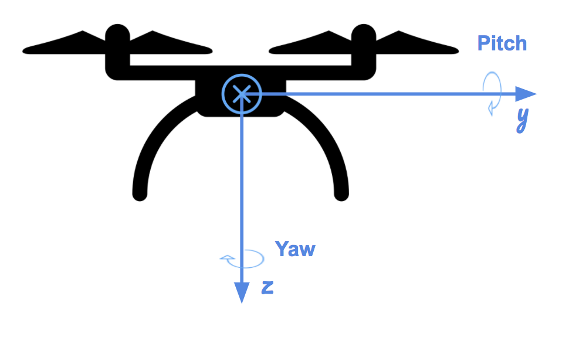

## Project: Control of a 3D Quadrotor




### Scenario 1 (Hover):


For the initial scenario, I updated the mass in `QuadControlParams.txt` so that the quad

### Scenario 2 (Body Rate and Roll/Pitch Control):


For the `GenerateMotorCommands()` method, I calculated the thrust components in the x, y, and z direction using the provided commanded collective thrust and the moments about the x, y, and z axis (roll, pitch, and yaw);
Using the relationship between Moments and Force ( Force = Moment / L_arm ), I determined the forces (thrust) that corresponded to the moments in the x, y, and z direction. The x and y moments factored in the arm length
of the quadrotor, where the arm length was equal to L / sqrt(2), since the x and y coordinate frame tied to the quadrotor is rotated at 45 degrees with respect to the quadrotor's arms. The moment in the z direction
is dependent on the drag to thrust ratio, kappa, since the propellers inherently induce a moment about the z axis while spinning.

```
float l = L / sqrt(2.f);

float Fx = momentCmd.x / l;
float Fy = momentCmd.y / l;
float Fz = momentCmd.z / kappa;
```

To apply the proper thrusts to each of the four propellers, I assigned a combination of the commanded collective thrust and the force component in each direction (x, y, z). I assigned the signs of the thrust components
by determining how each thrust component contributes to the roll, pitch, and yaw moments based on the coordinate system. For example, to induce a positive roll moment (x direction), the thrust component for the front left
and rear left propellers need to be positive. Similarly, for the z direction thrust, the front right and rear left propellers spin out of the screen, so they induce a positive reactive moment in the z direction, hence the
positive z direction thrust component. 

```
cmd.desiredThrustsN[0] = (collThrustCmd + Fx + Fy - Fz) / 4.f; // front left
cmd.desiredThrustsN[1] = (collThrustCmd - Fx + Fy + Fz) / 4.f; // front right
cmd.desiredThrustsN[2] = (collThrustCmd + Fx - Fy + Fz) / 4.f; // rear left
cmd.desiredThrustsN[3] = (collThrustCmd - Fx - Fy - Fz) / 4.f; // rear right
```

### Scenario 3 (Position/velocity and yaw angle control):


### Scenario 4 (Non-Idealities):


### Scenario 5 (Tracking trajectories):


