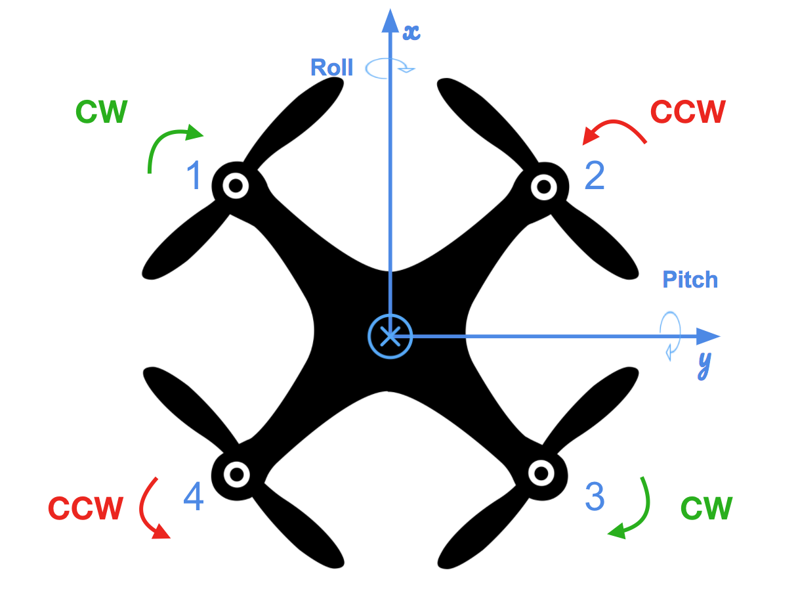

## Project: Control of a 3D Quadrotor

Quadrotor Coordinate System



### Scenario 1 (Hover):


For the initial scenario, I updated the mass in `QuadControlParams.txt` so that the quad

### Scenario 2 (Body Rate and Roll/Pitch Control):


For the `GenerateMotorCommands()` method, I calculated the thrust components in the x, y, and z direction using the provided commanded collective thrust and the moments about the x, y, and z axis (roll, pitch, and yaw);
Using the relationship between Moments and Force ( Force = Moment / L_arm ), I determined the forces (thrust) that corresponded to the moments in the x, y, and z direction. The x and y moments factored in the arm length
of the quadrotor, where the arm length was equal to L / sqrt(2), since the x and y coordinate frame tied to the quadrotor is rotated at 45 degrees with respect to the quadrotor's arms. The moment in the z direction
is dependent on the drag to thrust ratio, kappa, since the propellers inherently induce a moment about the z axis while spinning.

```
float l = L / sqrt(2.f);

float Fx = momentCmd.x / l;
float Fy = momentCmd.y / l;
float Fz = momentCmd.z / kappa;
```

To apply the proper thrusts to each of the four propellers, I assigned a combination of the commanded collective thrust and the force component in each direction (x, y, z). I assigned the signs of the thrust components
by determining how each thrust component contributes to the roll, pitch, and yaw moments based on the coordinate system. For example, to induce a positive roll moment (x direction), the thrust component for the front left
and rear left propellers need to be positive to cause the quad to rotate about the x axis. Similarly, for the z direction thrust, the front right and rear left propellers spin out of the screen, so they induce a positive
reactive moment in the z direction, hence the positive z direction thrust component.

```
cmd.desiredThrustsN[0] = (collThrustCmd + Fx + Fy - Fz) / 4.f; // front left
cmd.desiredThrustsN[1] = (collThrustCmd - Fx + Fy + Fz) / 4.f; // front right
cmd.desiredThrustsN[2] = (collThrustCmd + Fx - Fy + Fz) / 4.f; // rear left
cmd.desiredThrustsN[3] = (collThrustCmd - Fx - Fy - Fz) / 4.f; // rear right
```

To develop the `BodyRateControl()` controller method, I used a P controller since this controller is a 1st order system as it takes in rotation rates in the body frame (p, q, r) which are the first
derivative of the rotational position, and outputs commanded moments that are directly proportional to the body rotation rates. By determining the `bodyRateError` `V3F` object using the provided `pqrCmd` and `pqr` values,
packaging the moments of inertia into a `V3F` data type, and factoring in the `kpPQR` gain, I calculated the commanded moment and tuned the gain values for `kpPQR` until the quad could reach the set altitude while controlling it's
body frame rotations with minimal overshoot.

```
V3F momentCmd;
V3F momentOfInertia(Ixx, Iyy, Izz);
V3F bodyRateError = pqrCmd - pqr;
momentCmd = momentOfInertia * kpPQR * bodyRateError;
```

Lastly, to develop the `RollPitchControl()` controller, I implemented another P controller as it was also a 1st order system to control the commanded rates of changes of the roll and pitch angles in the body frame.
To obtain the actual body frame roll and pitch angles, I referenced the provided rotation matrix, `R` which maps the body frame orientations to the inertial frame. Since the third column of the rotation matrix represents the
mapping of the body frame orientations to the intertial frame's z axis, the actual body frame orientation is equal to R13 and R23.

```
float b_x_act = R(0, 2); // R13
float b_y_act = R(1, 2); // R23
```

Since the commanded roll and pitch angles were not directly accessible, I solved for them using the relationship between the collective thrust, linear acceleration, and the body frame orientation of the quad (rads) for the x and y axis.

```
x_dot_dot = Cc * b_x_cmd
y_dot_dot = Cc * b_y_cmd
```

After normalizing the collectiveThrustCmd by the quad's mass, I rearranged the above equations to solve for the commanded body frame orientations of the quadrotor in the x and y directions. And to ensure the tilt angles maintained
safe values, I constrained them so the quad couldn't rotate too far to attempt to achieve a greater acceleration.

```
float z_accel_cmd_bf = -collThrustCmd / mass;
float b_x_cmd = CONSTRAIN((accelCmd.x / z_accel_cmd_bf), -maxTiltAngle, maxTiltAngle);
float b_y_cmd = CONSTRAIN((accelCmd.y / z_accel_cmd_bf), -maxTiltAngle, maxTiltAngle);
```


### Scenario 3 (Position/velocity and yaw angle control):


### Scenario 4 (Non-Idealities):


### Scenario 5 (Tracking trajectories):


